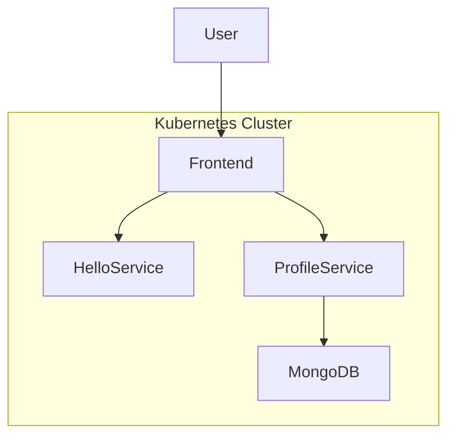

# 🚀 MERN Microservices Deployment on Kubernetes (GCP-ready)

## 📌 Project Overview

This project demonstrates the deployment of a **MERN (MongoDB, Express, React, Node.js)** microservices-based application using:

* Containerization with Docker
* Orchestration using Kubernetes
* Deployment tested on local Kubernetes (GKE-compatible)

The application consists of:

* Frontend (React)
* Backend microservices:
  * hello-service
  * profile-service
* MongoDB database

---

## 🧩 Architecture Diagram



---

## 🛠️ Tech Stack

* Docker
* Kubernetes
* Node.js
* React.js
* MongoDB
* kubectl
* Git & GitHub

---

## 📁 Project Structure

```
SampleMERNwithMicroservices/
├── frontend/
├── backend/
│   ├── helloService/
│   └── profileService/
├── k8s/
│   ├── frontend.yaml
│   ├── hello-service.yaml
│   ├── profile-service.yaml
│   └── mongodb.yaml
├── README.md
└── .gitignore
```

---

## ⚙️ Setup Instructions

### 1️⃣ Clone Repository

```
git clone https://github.com/<your-username>/mern-k8s-deployment.git
cd mern-k8s-deployment
```

---

### 2️⃣ Build Docker Images

```
docker build -t gcr.io/<project-id>/frontend ./frontend
docker build -t gcr.io/<project-id>/hello-service ./backend/helloService
docker build -t gcr.io/<project-id>/profile-service ./backend/profileService
```

---

### 3️⃣ Push Images

```
docker push gcr.io/<project-id>/frontend
docker push gcr.io/<project-id>/hello-service
docker push gcr.io/<project-id>/profile-service
```

---

### 4️⃣ Deploy to Kubernetes

```
kubectl apply -f k8s/
```

---

### 5️⃣ Verify Deployment

```
kubectl get pods
kubectl get svc
```


---

## 🌐 Access Application

### Option 1: Port Forward (Recommended)

```
kubectl port-forward service/frontend-service 8080:80
kubectl port-forward service/hello-service 3001:3001
kubectl port-forward service/profile-service 3002:3002
```

Open:

```
http://localhost:8080
```


---

### Option 2: NodePort

```
http://localhost:30007
```

---

## 🔍 API Endpoints

### Hello Service

```
GET /health
http://localhost:3001/health
```


### Profile Service

```
GET /health
http://localhost:3002/health
```


---

## ⚠️ Challenges Faced

* Missing Dockerfiles in initial project
* Multi-service backend required separate containerization
* Kubernetes CrashLoopBackOff debugging
* Environment variable mismatch (`MONGO_URL`)
* MongoDB connection configuration
* NodePort vs ClusterIP access issues

---

## ✅ Solutions Implemented

* Created Dockerfiles for each microservice
* Used Kubernetes Deployments & Services
* Injected environment variables via YAML
* Deployed MongoDB inside cluster
* Used port-forward for local access
* Fixed service communication issues

---

## 🎯 Key Learnings

* Microservices architecture in Kubernetes
* Docker image lifecycle
* Kubernetes networking (ClusterIP vs NodePort)
* Debugging real-world deployment issues
* Environment variable management in containers

---

---

## 👩‍💻 Author

**DEEPIKA NARENDRAN**
*DevOps Technical Lead | *

---

## 🚀 Conclusion

This project successfully demonstrates deploying a scalable MERN microservices application using Kubernetes. It highlights real-world DevOps practices including containerization, orchestration, service communication, and troubleshooting.

---
